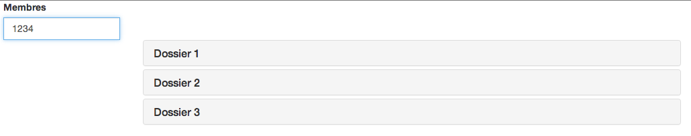
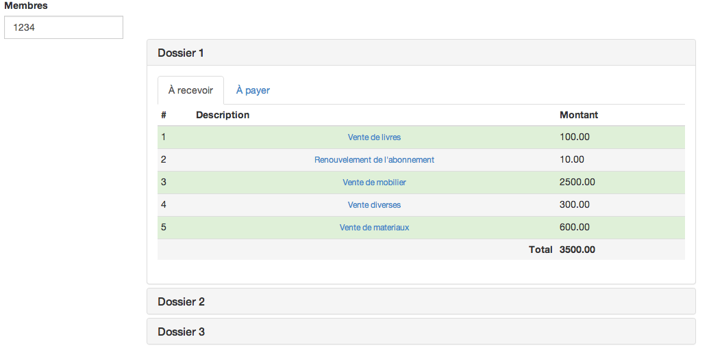
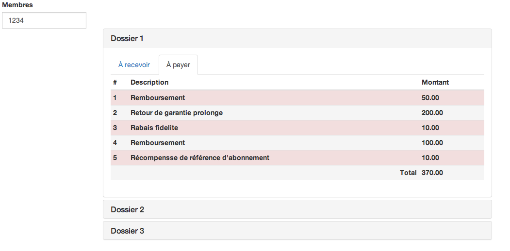
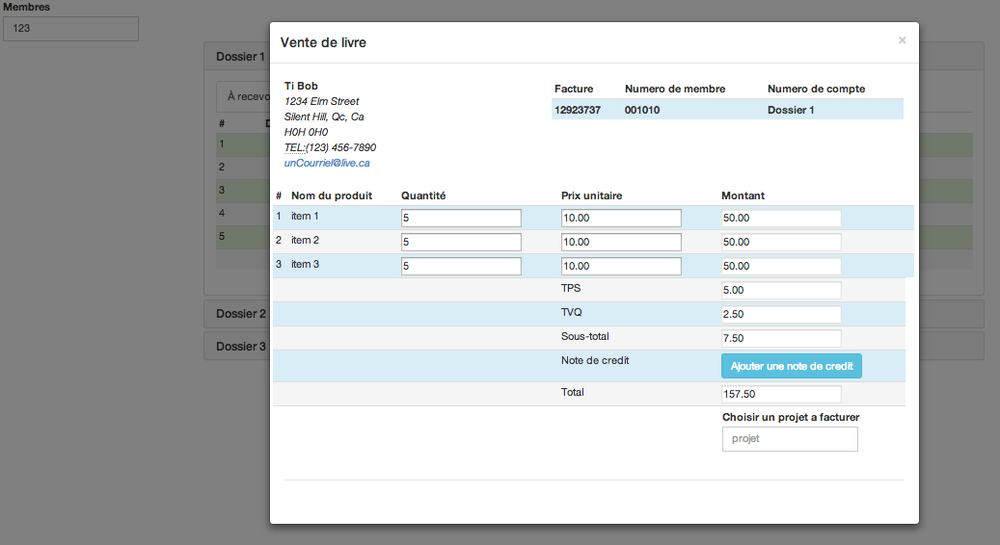
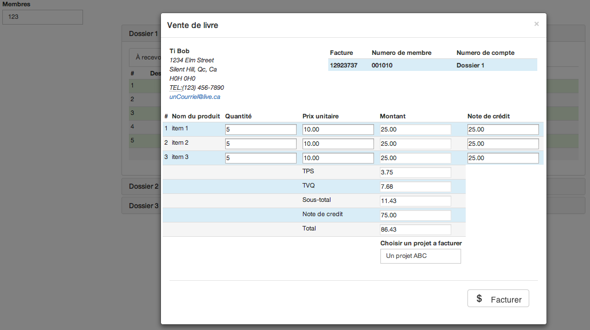
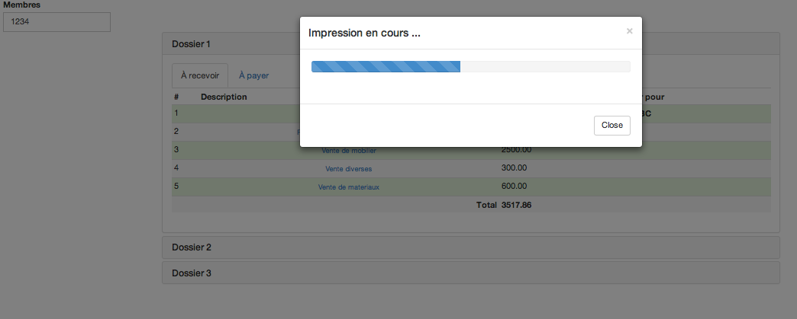

**Logiciel Comptable**

**Manuel de l'utilisateur**

#   **Table de matière**

1. Introduction
2. Le Guide
3. FAQ
4. Coordonnées
5. Glossaire

#1.  **Introduction**

Logiciel comptable permettant de faire la gestion des dossiers des membres et d'émettre des factures. La version actuelle est un prototype.

#2. **Le Guide**

### Sur la page d'accueil l'utilisateur doit entrer un numéro de membre et appuyer sur la touche **entrée** pour afficher la liste des dossiers qui le concerne.

###Cliquer ensuite sur l'onglet d'un dossier afin d'afficher et consulter les détails.

###Le premier onglet est un sommaire des comptes à recevoir, un **clic** sur l'onglet **à payer** permet de consulter le sommaire des comptes à payer.

###Il est possible de consulter et de modifier les détails d'un compte à recevoir. Cette fenêtre affiche des détails de facturation tel que:

* Le nom du membre à qui s'adresse la facture
* L'adresse de facturation
* Le numéro de téléphone du membre
* Le courriel du membre
* Le numéro de facture
* Le numéro du membre
* Le numéro du compte
* Nom des produits
* Les quantités
* Les prix unitaire
* Les taxes
* Les totaux
* Une fonctionnalité permettant de créer une note de crédit
* Le nom du projet que l'on désire facturer

###Les champs de quantités ainsi que ceux des prix unitaire sont modifiables.

###Il est possible d'effectuer la facturation de la totalité du compte à recevoir ou d'émettre une note de crédit facturant en partie selon des montants entrés par l'utilisateur.

###L'impresssion de la facture s'effectue en cliquant sur le bouton **$ Facturer** qui s'affiche après avoir taper le nom du projet

#3. **FAQ**

 * **Comment puis-je afficher la liste des dossiers d'un membre ?**
 _En entrant son numéro dans la boite texte *Membre* de la page d'acceuil et en appuyant sur *Entré*_

 * **Comment puis-je Consulter le contenu d'un dossier ?**
 _En cliquant sur le nom du dossier._

 * **Comment puis-je fermer un dossier ?** 
 _En cliquant sur son nom._
 
 * **Où puis-je trouver les comptes à recevoir?**
 _En cliquant sur l'onlget **À Recevoir** d'un dossier._
 
 * **Où puis-je trouver les comptes à payer?**
 _En cliquant sur l'onlget **À payer** d'un dossier._
 
 * **Pourquoi est-ce que je ne vois aucun détails?**
 _Pour voir les détails vous devez cliquer sur le lien de la description dans la liste des comptes à recevoir._
 
 * **Je dois modifier une facture, comment puis-je faire?**
 _Les champs **Quantité** ainsi que **Prix unitaire** sont modifiables._
 
 * **Je ne désire pas facturer la totalité du compte à recevoir, que faire?**
 _Vous pouvez émettre une note de crédite en cliquant sur le bouton **Ajouter une note de crédit** et en entrant les montants que vous désirez facturer_
 
 * **Comment faire pour facturer sur un projet en particulioer?**
 _En entrant le nom du projet dans la boite texte **Choisir un projet à facturer**_

#4. **Coordonnees**

Eric Tremblay  TREE1307906
tremblay.eric.18@courrier.uqam.ca

Joe-Ricardo Solon SOLJ06048503
solon.joe-ricardo@courrier.uqam.ca

#5. **Glossaire**

* **membres** _Clients de l'entreprise qui se sont enregistrés_
* **numéro de membre** _Chaque membre est identifié dans le système par un numéro unique_
* **liste des dossiers** _Un membre peut avoir plusieurs dossier transactionnel_
* **dossiers** _Contient des transactions faites par le membre_
* **compte à recevoir** _Montants à réclamer au membre_
* **comptes à payer** _Montants à verser au un membre_
* **note de crédit** _Facturation partiel d'un compte à payer_